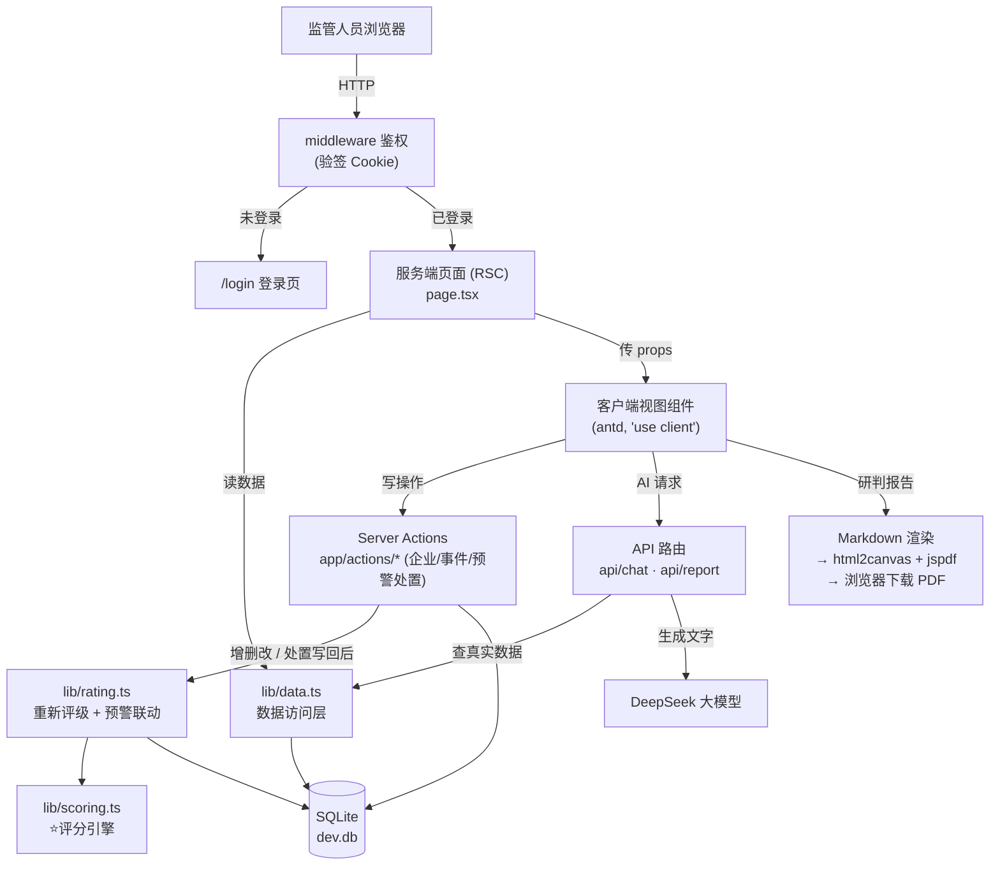
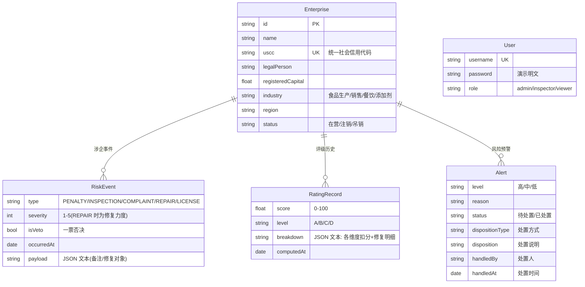

# 食品企业信用风险分类管理系统 — 系统功能设计说明

> 本文系统梳理"系统现在有哪些功能、各自怎么设计"。
> 配套：开发约定见 [`CLAUDE.md`](./CLAUDE.md)，作业要求见 [`作业要求.md`](./作业要求.md)。
> 覆盖范围：评分引擎（含信用修复加分）+ 涉企事件增删改 + 登录鉴权与三级角色 + 企业档案增删改 + **预警处置闭环** + **AI 内容 Markdown 渲染与研判报告 PDF 导出**。

---

## 一、系统概述

面向**市场监管**场景的食品企业信用风险分类管理系统。归集企业基础信息、行政处罚、抽查检查、投诉举报、信用修复等多维涉企数据，通过**标准化指标 + 确定性评分引擎**自动完成企业信用风险 **A/B/C/D 四级**动态评级，并提供风险监测、动态预警与处置闭环、分级监管、数据统计、AI 智能研判等能力。

**核心理念**：评级由**可解释、可复现的确定性算法**得出，**不交给大模型**；大模型只负责"自然语言研判"和"对话式数据查询"。这符合监管场景"为什么是这个等级，必须说得清"的要求。

### 对照作业要求的能力点落地情况

| 作业要求能力 | 本系统实现 | 状态 |
|---|---|---|
| 风险监测 | 监管总览看板（等级分布、行业分布、关键指标） | ✅ |
| 智能研判 | AI 对话助手 + 一键生成研判报告（Markdown 渲染 + 导出 PDF） | ✅ |
| 动态预警 | 评级落 C/D 或一票否决自动生成预警，并支持人工处置闭环 | ✅ |
| 分级监管 | 按 A/B/C/D 给出差异化监管建议 | ✅（建议文案）|
| 数据统计 | 总览页统计 + 图表 | ✅ |
| 台账管理 | 企业档案 / 事件 / 评级历史的增删改查 | ✅（Excel 导出待做）|
| 标准化指标 + 评分模型 | 5 维度确定性评分引擎（扣分 + 信用修复加分，可升可降） | ✅ |
| 早发现 / 早提醒 / 早处置 | 事件录入即重评级 + 联动预警 + **处置销警 / 措施回写 / 自动核销**完整闭环 | ✅ |
| 结果共享应用 | 当前本地库；云端共享待做 | ◻ |

---

## 二、总体架构

### 技术栈

| 层 | 选型 | 版本 |
|---|---|---|
| 全栈框架 | Next.js（App Router, TS） | 16.x |
| UI | Ant Design（中文 locale，不用 Tailwind） | 6.x |
| 图表 | ECharts（自封装 `EChart.tsx`） | 6.x |
| ORM | Prisma + driver adapter | 7.x |
| 数据库 | SQLite（本地文件 `dev.db`） | — |
| 大模型 | DeepSeek（`deepseek-chat`，OpenAI 兼容） | — |
| AI 编排 | Vercel AI SDK（`ai` + `@ai-sdk/react` + `@ai-sdk/deepseek`） | 6.x |
| Markdown 渲染 | react-markdown + remark-gfm（共用 `components/Markdown.tsx`） | — |
| PDF 导出 | jspdf + html2canvas-pro（客户端，研判报告下载，按需动态 import） | — |
| 运行时 | React 19 / Node 24 | — |

Node 全栈、单仓库、**前后端不分离**。

### 分层与数据流



**三类"写"入口**：
- **Server Actions**（`app/actions/*`）—— 登录、企业 CRUD、事件 CRUD、**预警处置**。客户端组件直接 `await` 调用，写库后 `revalidatePath` 让相关页面**自动刷新**，无需手写 `router.refresh()`。
- **API 路由**（`app/api/*`）—— 两个 AI 端点（流式对话 / 非流式报告）。
- **middleware**（`middleware.ts`）—— 在 Edge 层拦截未登录请求。

**关键约定**：antd 只在 `'use client'` 组件里用；服务端页面只负责取数 + 鉴权判断，再把数据和权限标志传给客户端视图。

---

## 三、数据模型



- **统一事件表 `RiskEvent`**：所有涉企事件（处罚/抽检/投诉/修复/许可）归一到一张表，是评分引擎的**唯一数据源**。信用修复事件的 `payload` 还存 `修复对象`（指明把分加回哪个维度）。
- **评级历史 `RatingRecord`**：每次评级追加一条，保留历史 → 支撑"评级走势图"与台账。`breakdown` 同时含每维度的扣分明细与信用修复明细。
- **预警 `Alert`**：除级别/原因/状态外，含**处置留痕字段**（处置方式 / 说明 / 处置人 / 处置时间）。
- **SQLite 无 JSONB**：`payload`、`breakdown` 用 `String` 存 JSON 文本，应用层 `JSON.parse`。
- 删除企业 / 事件时 `onDelete: Cascade` 级联清理其下属记录。

---

## 四、核心：信用风险评分引擎（`lib/scoring.ts`）

纯函数、确定性、可解释。满分 100，五维度加权相加；**两遍计算**：先扣分，再处理信用修复加分，使分数可升可降。

### 维度权重

| 维度 | 满分 | 说明 |
|---|---|---|
| 基础经营 BASE | 10 | 经营状态（注销/吊销扣分） |
| 行政处罚 PENALTY | 35 | 权重最高 |
| 抽查检查 INSPECTION | 25 | |
| 投诉举报 COMPLAINT | 20 | |
| 信用记录 CREDIT | 10 | 基础信用基线（默认满分） |

### 扣分 / 加分规则（两遍计算）

**第一遍 · 扣分**（负面事件按 `severity × 系数 × 时间衰减` 扣对应维度）：

| 事件类型 | 作用 | 公式 |
|---|---|---|
| 行政处罚 PENALTY | 扣 PENALTY 维 | `severity × 3 × 时间衰减` |
| 抽查检查 INSPECTION | 扣 INSPECTION 维 | `severity × 2.5 × 时间衰减` |
| 投诉举报 COMPLAINT | 扣 COMPLAINT 维 | `severity × 2 × 时间衰减` |
| 经营状态 | 扣 BASE 维 | 吊销 → 0 分；注销 → 5 分 |
| 许可资质 LICENSE | 信息性，不影响评分 | — |

**第二遍 · 信用修复加分**（让分数可主动回升）：

| 事件类型 | 作用 | 公式 |
|---|---|---|
| 信用修复 REPAIR | 把分**加回到「修复对象」维度**（行政处罚/抽查/投诉），**封顶不超过该维度满分** | `+ 修复力度(severity) × 2` |

- **修复对象**存于 `payload.修复对象`；未指定时引擎自动回补当前**扣分最多**的维度。
- **扣分与修复明细并存**（`breakdown[].deductions` / `breakdown[].repairs`）→ **分数可升可降，且不删除原扣分记录**（违规事实永久可查）。
- **时间衰减**（越久远影响越小）：≤1 年 ×1.0；≤2 年 ×0.6；≤3 年 ×0.3；>3 年 ×0.15。

> 举例：某企业被罚 → 行政处罚维 35→20（总分降）；整改后录一条"修复对象=行政处罚、力度 5"的信用修复 → 该维 20→30（总分升）；明细里"-15 处罚"与"+10 修复"两条并存。

### 定级

- 阈值：**A ≥ 85，B ≥ 70，C ≥ 60，否则 D**。
- **一票否决**：任一 `isVeto` 事件（严重食品安全事故）→ 直接定 **D 级**，分数压到 ≤ 40，**信用修复也抬不动**。
- 输出 `breakdown`（每维度扣分/修复明细）+ `topRisks`（扣分最多的若干项）→ 支撑"为什么是这个等级"的解释与 AI 研判。

### 自动重新评级机制（`lib/rating.ts` → `reRateEnterprise`）

让评级"活"起来的关键。**任何对企业 / 事件的增删改、以及预警处置写回措施事件之后都会调用**：

```
取该企业全部事件 → 跑 scoring 引擎 → 追加一条 RatingRecord（留历史）→ 联动刷新预警
```

**预警联动（闭环的"自动"半边）**：
- 评级落 C/D 或一票否决 → 若无对应级别"待处置"预警则自动生成（幂等，不重复建警）；
- 评级**回升至 A/B（风险消除）→ 自动核销**残留的待处置预警（标记为"系统自动核销"）。

---

## 五、功能模块详解

### 5.1 登录鉴权与角色权限

| 项 | 说明 |
|---|---|
| 入口 | `/login`（未登录访问任意页由 middleware 跳转至此） |
| 机制 | **轻量自建会话**：HMAC-SHA256 签名的 HttpOnly Cookie，无外部依赖 |
| 关键文件 | `lib/auth.ts`（edge-safe 验签/角色判定）、`lib/session.ts`（读当前用户）、`app/actions/auth.ts`（登录/登出）、`middleware.ts`（拦截） |
| 演示账号 | `admin/admin123`、`inspector/123456`、`viewer/123456` |

设计要点：`lib/auth.ts` 用 Web Crypto，可同时在 Edge（middleware 验签）与 Node（服务端）运行，**不引入 `next/headers`**；真正读 Cookie 的 `getSession()` 单独放在 `lib/session.ts`。

### 5.2 监管总览（`/`）

- 4 个关键指标卡：纳管企业总数、D 级高风险数、待处置预警、归集风险事件。
- 信用等级分布饼图 + 各行业风险等级堆叠柱状图（ECharts）。
- 最新风险预警列表（可跳企业详情）。
- 文件：`app/page.tsx`（取数）→ `components/DashboardView.tsx`。

### 5.3 企业信用名录（`/enterprises`）

- 表格展示全部企业（名称/行业/区县/法人/等级/得分/事件数/状态），支持按**等级、行业、关键词**筛选，等级与得分可排序。
- 有写权限者（admin/inspector）显示 **「新增企业」** 按钮。
- 文件：`app/enterprises/page.tsx` → `components/EnterpriseTable.tsx`。

### 5.4 企业详情与档案管理（`/enterprises/[id]`）

一页集中展示并管理单个企业，是功能最密集的页面：

- **企业档案卡**：基础信息；写权限者可 **「编辑档案」**，管理员可 **「删除企业」**。
- **信用风险评级卡**：等级 / 得分 / 分级监管建议；可「重新评级」；可「AI 生成研判报告」（生成有 loading 态，结果 Markdown 渲染，**可一键下载 PDF**）。
- **各维度得分明细**：每维度进度条 + 扣分项 + **信用修复加分项**（绿色）。
- **评级走势**：基于 RatingRecord 历史的折线图（含 A/B/C 阈值参考线）。
- **主要风险因素** + **涉企风险事件时间线**（可录入/编辑/删除事件）。
- **该企业的风险预警**：列出待处置/已处置预警，执法员可就地「处置」。
- 文件：`app/enterprises/[id]/page.tsx` → `components/EnterpriseDetailView.tsx`（+ `EnterpriseFormModal`、`RiskEventFormModal`、`AlertDisposeModal`、`Markdown`）。

**企业档案 CRUD**（`app/actions/enterprises.ts`）：
- 新增 → 建档后自动生成初始评级（无事件通常 A/100）→ 跳转新企业详情。
- 编辑 → 改经营状态会影响评分，保存后**自动重新评级**。
- 删除 → 级联清理其事件/评级/预警（**仅管理员**）。
- USCC 唯一性校验、友好报错；新增支持随机生成 USCC。

### 5.5 涉企事件管理

- 在企业详情页对事件做**增 / 改 / 删**（处罚/抽检/投诉/修复/许可，含严重度、发生时间、一票否决、备注）。
- **信用修复(REPAIR)** 录入时需选「修复对象」，且"严重程度"显示为「修复力度（+N 分）」，语义更贴切。
- 每次写库后**自动重新评级**：等级、得分、预警、走势图随之更新，页面自动刷新。
- 文件：`app/actions/events.ts` + `components/RiskEventFormModal.tsx`。

### 5.6 风险预警与处置闭环（`/alerts`）

- 表格展示全部预警（级别/企业/行业/区县/原因/状态/**处置情况**/时间），可按"待处置/已处置"过滤；已处置行可展开看完整处置详情。
- **预警来源**：① seed 初始化；② 评级落 C/D 或一票否决时由 `reRateEnterprise` 自动生成。
- **处置闭环**（执法员/管理员）：
  - **处置销警**：选处置方式（现场核查 / 责令整改 / 约谈告诫 / 督促信用修复 / 记录归档）+ 填处置说明 → 标记"已处置"并留痕（处置方式/说明/处置人/时间）。
  - **可选措施回写**：处置时可勾选"同步登记一条监管措施事件"，写回该企业并**自动重新评级**（闭环回流）。
  - **撤销处置**：误处置可退回"待处置"并清空留痕。
  - **自动核销**：企业评级回升至 A/B 时，系统自动核销其残留待处置预警。
- 文件：`app/alerts/page.tsx` → `components/AlertsView.tsx` + `components/AlertDisposeModal.tsx`；写入口 `app/actions/alerts.ts`。

### 5.7 AI 智能研判

| 用法 | 实现 | 说明 |
|---|---|---|
| **对话 Agent** | `app/api/chat/route.ts` | `streamText` + 工具调用（`stopWhen: stepCountIs(6)`）。4 个工具 `listEnterprises`/`getEnterpriseProfile`/`explainRating`/`getStatistics` **全部查真实数据库**再作答。前端右下角悬浮 `ChatWidget`，助手消息经 `Markdown` 渲染。 |
| **研判报告** | `app/api/report/route.ts` | `generateText` 基于企业数据生成"总体结论 + 风险点 + 监管建议"报告。前端生成有 loading 态、结果 Markdown 渲染；点「下载 PDF」把离屏 `.pdf-doc` 文档用 html2canvas-pro 截图、jspdf 多页拼装后浏览器直接下载。 |

两个 AI 端点入口都校验登录（未登录返回 401，避免未授权消耗 DeepSeek 配额）。**大模型只产出文字，不参与定级。**

---

## 六、角色与权限矩阵

| 功能 | 查询岗 viewer | 监管执法员 inspector | 管理员 admin |
|---|:---:|:---:|:---:|
| 查看总览/名录/详情/预警/AI | ✅ | ✅ | ✅ |
| 录入 / 编辑 / 删除涉企事件 | ❌ | ✅ | ✅ |
| 重新评级 | ❌ | ✅ | ✅ |
| 新增 / 编辑企业档案 | ❌ | ✅ | ✅ |
| **处置 / 撤销预警** | ❌ | ✅ | ✅ |
| 删除企业 | ❌ | ❌ | ✅ |

**双重把关**：写权限既在**前端隐藏按钮**（`canWrite` / `isAdmin`），又在 **Server Action 端二次校验**（防绕过 UI 直接调用）。删除企业属高危操作，故收紧到仅管理员；inspector 需"停业"可改 `status` 为注销/吊销（软删除路径）。

---

## 七、关键设计取舍

- **为什么评级不交给大模型？** 监管场景要求可解释、可复现、可追溯。确定性算法能逐维度说清"扣了多少、为什么"，大模型做不到稳定复现。大模型只做研判文字与对话查询。
- **为什么信用修复加回"原维度"而非单独加分？** 既能让整改后的企业分数真正回升，又让"扣分 / 修复"明细一一对应、可追溯；封顶不超满分，避免刷分。
- **为什么预警处置的"措施回写"是可选项？** 并非每种处置都改变风险（现场核查、督促修复会，约谈、归档则不一定）。强制写回会制造无意义的假事件、污染评分，故做成可选。
- **为什么自建鉴权而非 Auth.js？** 栈本身已很新（Next 16 / React 19），再叠 NextAuth beta 风险大；本系统鉴权需求简单（用户名密码 + 三角色），自建 Cookie 会话零依赖、全可控、易解释。
- **为什么删除企业仅管理员？** 硬删除会级联清空全部监管历史，现实中企业一般"注销/吊销"而非删除，故收紧权限。
- **PDF 为什么用"截图"而非矢量文本？** 截图渲染对中文零乱码、所见即所得；代价是 PDF 内文字不可选中（矢量方案需内嵌中文字体，复杂度高）。
- **数据库为什么是本地 SQLite？** 演示/教学足够轻量。**注意：`dev.db` 不进 Git，团队各自 seed 出各自的随机数据**，互不相通；若需共享实时数据需切云端 Postgres（见第八节与 TODO）。

---

## 八、数据与初始化

- **数据库**：本地 SQLite 文件 `dev.db`，被 `.gitignore` 排除，**不提交、不共享**。
- **造数据**：`prisma/seed.ts` 用随机数生成 80 家企业 + 涉企事件（含针对真实扣分维度的信用修复）+ 评级 + 预警，并建 3 个演示账号。因用 `Math.random()`，**每人 seed 出的数据各不相同**（仅登录账号一致）。
- **克隆后首次运行**：

  ```bash
  npm install                # postinstall 自动 prisma generate
  npx prisma migrate dev     # 按迁移建出 dev.db（表结构）
  npm run seed               # 灌入 80 家模拟企业
  cp .env.example .env.local # 填入自己的 DEEPSEEK_API_KEY
  npm run dev                # http://localhost:3000
  ```

- **拉取更新后（已 clone 过）**：

  ```bash
  git pull
  npm install                # 可能有新依赖
  npx prisma migrate dev     # 应用新迁移（表结构变更时必须，否则相关页面报"列不存在"）
  npm run seed               # 可选：评分规则变更后旧评级是陈旧的，重建才能看到新效果
  npm run dev
  ```

- **环境变量**：`.env`（已提交，仅 `DATABASE_URL`）；`.env.local`（gitignore，含 `DEEPSEEK_API_KEY`、可选 `AUTH_SECRET`）。

---

## 九、已实现 vs 后续规划

**已实现**：评分引擎（扣分 + **信用修复加分，可升可降且保留扣分记录**）· 监管总览 · 企业名录 · 企业详情 · 企业档案 CRUD · 涉企事件 CRUD · 自动重新评级 · 评级走势图 · 动态预警生成 · **预警处置闭环（处置销警 / 措施回写 / 自动核销）** · 登录鉴权 + 三级角色 · AI 对话助手（Markdown 渲染）· AI 研判报告（Markdown 渲染 + **导出 PDF**）。

**后续 TODO**（详见 `CLAUDE.md` 第 10 节）：
- 台账导出 Excel
- 分级监管：按等级**自动生成抽查计划**（评级→主动派活的"前置"闭环，目前靠人工录事件触发）
- 切换云端 Postgres，实现团队数据共享
- 密码哈希存储（当前为演示明文）
